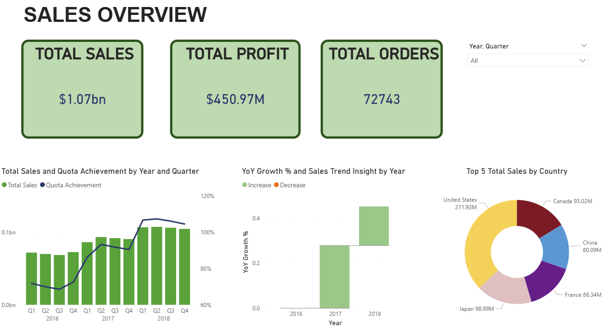

Multinational Retail Sales Analysis
Project Context
This project was developed for The Next Analyst competition. It involves analyzing a large-scale retail dataset with over $1.07 billion in total sales across multiple international markets.

Business Requirements
The analysis was designed to answer key strategic questions:

Market Performance: Identify which regions (North America, Europe, Asia, etc.) drive the highest profit and revenue.

Product Strategy: Evaluate product positioning and Year-over-Year (YoY) growth to prioritize high-performing categories.

Channel Efficiency: Compare sales methods (Web, Sales visit, Telephone, etc.) to optimize resource allocation.

Operational Excellence: Track sales manager performance against a $100M annual quota.

Technical Implementation
Tools: Microsoft Power BI, Power Query, DAX.

Data Modeling: Established a star schema to integrate regional, product, and sales data.

KPI Development: Implemented measures for Quota Achievement, Profit Margin, and Sales Trends.

Key Insights
Sales Channels: The Web channel is the primary revenue driver, contributing 83.3% ($890.27M) of total sales.

Regional Contribution: North America is the most profitable region, contributing $211.93M.

Product Trends: Video Games and Consoles lead in total profit, though some categories show declining YoY growth in recent periods.

Dashboard Structure
Sales Overview: High-level KPIs and global distribution.

Product Analysis: Product line performance and market positioning.

Regional Analysis: Deep-dive into country-level metrics.

Sales Channel: Detailed breakdown of order methods.

Team Performance: Evaluation of sales force efficiency.